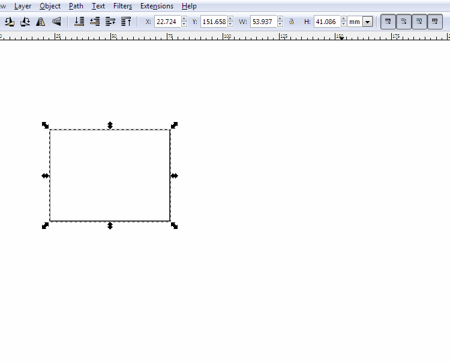
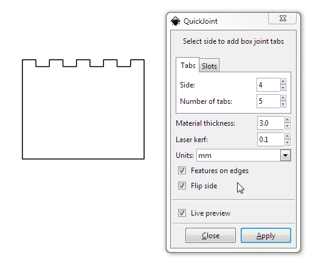
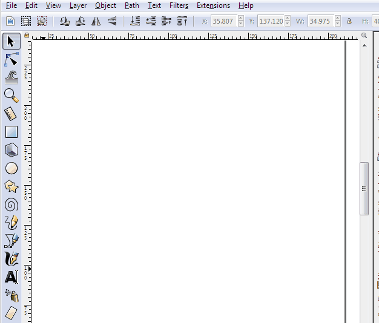

QuickJoint
================

## What's this?

This is an Inkscape extension to help rapidly prototype 3D assemblies using a laser cutter, CNC router, waterjet cutter, or similar 2D process.

It can quickly add box tabs to objects.

Target material size and other mechanical properties are configurable.

Mating slots can be generating using a path as a guide.

## Installation

To install, in Inkscape, go to `Edit > Preferences > System` and take note of the `User extensions` folder.

On my machine, it was `C:\Users\Jarrett\AppData\Roaming\inkscape\extensions`. I had to create the `inkscape\extensions` folders myself, due to the way I'd installed Inkscape.

Copy the two main files, `quickjoint.inx` and `quickjoint.py` into that folder, and restart Inkscape.

This extension requires Inkscape 1.0 or newer. There is a legacy version (v0.91 and v0.92 only probably) available in `Releases` on the sidebar.

## Contributing

Bug reports and pull requests welcome. This is a pretty small side project so I don't expect a whole lot to change, but incremental improvements are rad.

## Further Reading

I wrote some more background on this, and also a brief primer on writing Inkscape extensions on my website, [here](https://jrainimo.com/build/?p=1380).